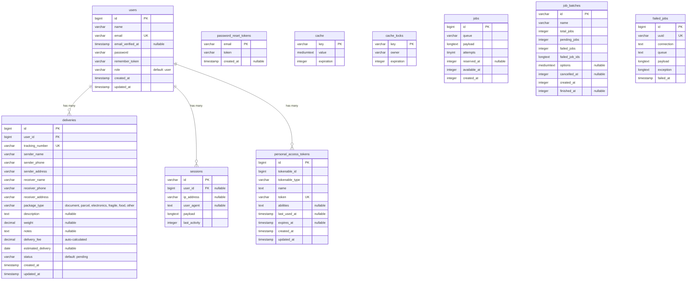

# Delivery Management System

A web-based parcel delivery and tracking management system built with **Laravel 12**, designed to help users create, manage, and track delivery orders across provinces in **Cambodia**.

## Features

### Authentication

- Custom-built user registration and login system
- Session-based authentication with "remember me" support
- Role-based user accounts (default: `user`)

### Delivery Management

- **Create deliveries** — Fill in sender/receiver details (name, phone, province), package type, weight, and notes
- **Auto-generated tracking number** — Each delivery gets a unique `DLV-XXXXXXXX` tracking ID
- **Auto-calculated delivery fee** — Based on package weight ($1.00 ≤ 20kg, $2.50 > 20kg)
- **Status tracking** — Full lifecycle management:
  `Pending` → `Picked Up` → `In Transit` → `Delivered`
  (or `Cancelled` at any stage)
- **View all deliveries** — Paginated list with status badges and tracking numbers
- **Delivery detail page** — Complete breakdown with sender/receiver info, fee, and status timeline

### Dashboard

- Overview statistics: Total deliveries, Pending count, Delivered count
- Recent 5 deliveries quick-view table

### Internationalization (i18n)

- Supports **English** and **Khmer (Cambodian)** languages
- One-click language toggle in the navigation bar

## Tech Stack

| Layer          | Technology                                           |
| -------------- | ---------------------------------------------------- |
| **Framework**  | Laravel 12.x (PHP 8.2+)                              |
| **Database**   | SQLite (with migration support for MySQL/PostgreSQL) |
| **Frontend**   | Bootstrap 5.3, Bootstrap Icons, Blade templating     |
| **Build Tool** | Vite 7 + Tailwind CSS v4                             |
| **Auth**       | Custom session-based authentication                  |
| **API Auth**   | Laravel Sanctum (installed, for future API use)      |

## Database Schema

### Entity Relationship Diagram



## Routes

### Guest Routes

| Method     | URI              | Description                   |
| ---------- | ---------------- | ----------------------------- |
| `GET`      | `/`              | Redirects to login            |
| `GET/POST` | `/login`         | Login form & handler          |
| `GET/POST` | `/register`      | Registration form & handler   |
| `GET`      | `/lang/{locale}` | Switch language (`en` / `km`) |

### Authenticated Routes

| Method | URI                       | Description                              |
| ------ | ------------------------- | ---------------------------------------- |
| `GET`  | `/dashboard`              | Dashboard with stats & recent deliveries |
| `POST` | `/logout`                 | Logout                                   |
| `GET`  | `/deliveries`             | List all user's deliveries               |
| `GET`  | `/deliveries/create`      | Create delivery form                     |
| `POST` | `/deliveries`             | Store new delivery                       |
| `GET`  | `/deliveries/{id}`        | View delivery details                    |
| `PUT`  | `/deliveries/{id}/status` | Update delivery status                   |

## Screenshots

_(Add screenshots of your application here for presentation)_

## Installation

```bash
# Clone the repository
git clone https://github.com/nounthanith/laravel-project-y3-s2.git
cd laravel-project-y3-s2

# Install PHP dependencies
composer install

# Install Node.js dependencies
npm install

# Copy environment file
cp .env.example .env
# Edit .env with your database configuration

# Generate application key
php artisan key:generate

# Run database migrations
php artisan migrate

# Build frontend assets
npm run build

# Start the development server
php artisan serve
```

## Usage

1. **Register** a new account at `/register`
2. **Login** at `/login`
3. **Create a delivery** from the dashboard or `/deliveries/create`
4. **Track deliveries** from the deliveries list at `/deliveries`
5. **Update status** by viewing a delivery and using the status update form
6. **Switch language** using the language toggle in the navigation bar

## Presentation Summary

This project demonstrates:

- Full-stack Laravel development with MVC architecture
- Custom authentication system (registration, login, session management)
- Eloquent ORM with model relationships (`User` has many `Delivery`)
- Database migrations and schema design
- Form validation and request handling
- Bootstrap 5 responsive UI design
- Internationalization (i18n) with English and Khmer
- Auto-generated unique identifiers (tracking numbers)
- Business logic automation (fee calculation based on weight)
- Pagination and data presentation

## License

This project is open-sourced under the MIT license.

## Language en / kh

- use locale

```
Route::get('/lang/{locale}', function ($locale) {
    if (in_array($locale, ['en', 'km'])) {
        session(['locale' => $locale]);
    }
    return redirect()->to('/');
})->name('lang.switch');
```
